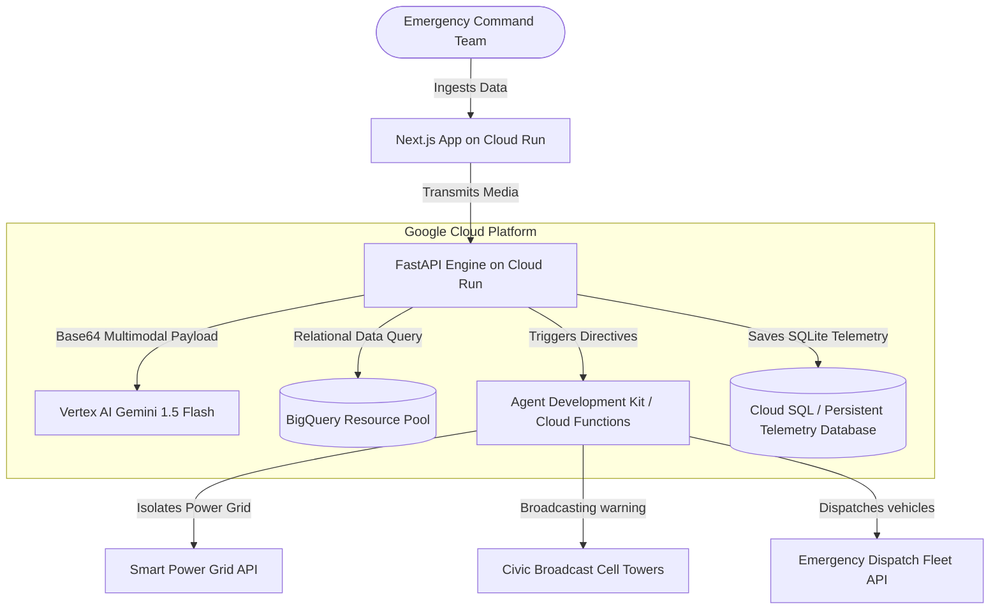
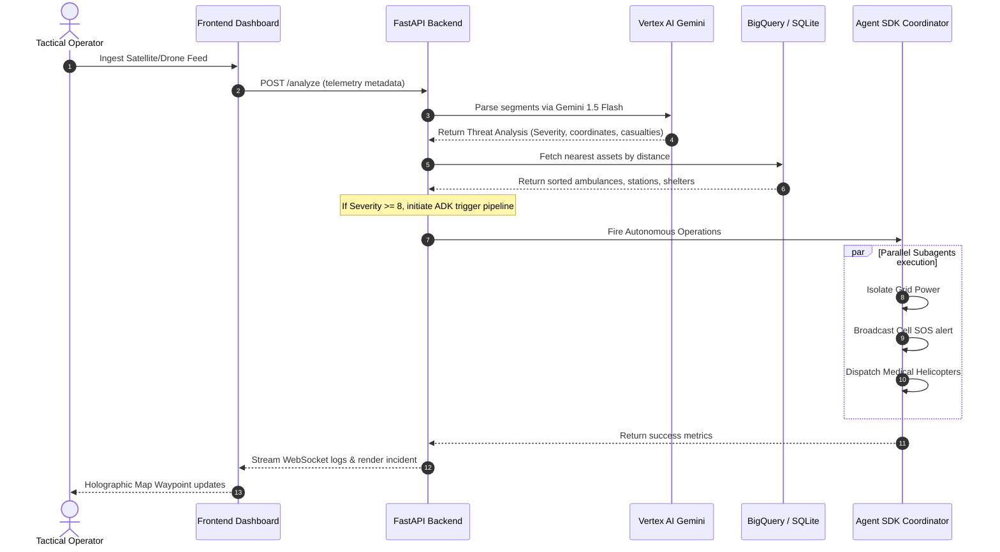
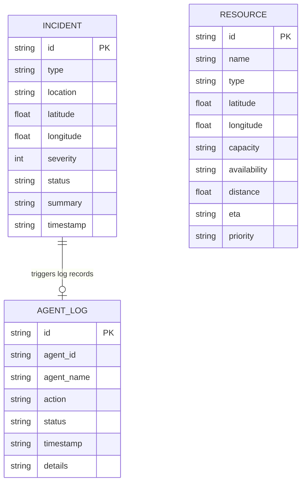

# ResiliShield AI - Architecture & Spec Sheet

This document maps out the system architecture, ER relational data models, sequence patterns, and GCP resource layers of the platform.

---

## 1. Cloud-Native Architecture Diagram



---

## 2. Telemetry Ingestion Sequence Diagram

The following chart diagrams the execution thread when a commander drops drone footage or telemetry feeds.



---

## 3. Entity-Relationship (ER) Schema



---

## 4. API Specification

### `POST /analyze`
*   **Request Payload**:
    ```json
    {
      "type": "fire",
      "location": "SOMA District",
      "latitude": 37.777,
      "longitude": -122.412,
      "description": "Engulfed structures with thick dark smoke."
    }
    ```
*   **Response Payload**:
    ```json
    {
      "id": "inc-32fa4c",
      "severity": 9,
      "status": "active",
      "summary": "Vertex AI assessment: Heavy smoke engulfing structural foundations.",
      "analysis": {
        "confidence": 0.95,
        "human_presence": true,
        "fire_detection": true,
        "flood_probability": 0.05,
        "risk_level": "CRITICAL"
      }
    }
    ```

### `POST /dispatch`
*   **Request Payload**:
    ```json
    {
      "agent_id": "1",
      "action": "dispatch_rescue",
      "incident_id": "inc-32fa4c"
    }
    ```
*   **Response Payload**:
    ```json
    {
      "status": "SUCCESS",
      "agent": "CrisisCoordinatorAgent",
      "timestamp": "2026-07-03 11:42:00",
      "actions": [
        "Aegis Sentinel dispatched trauma helicopters and rescue trucks."
      ]
    }
    ```
